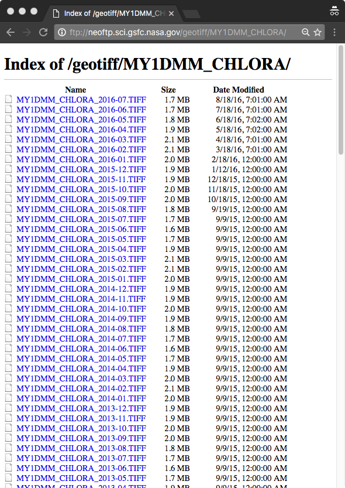

# Raw Data from NASA

* The raw data from NASA has two ways to download Data

## Web server
* http://neo.sci.gsfc.nasa.gov/view.php?datasetId=MY1DMM_CHLORA&date=2016-07-01
* `curl` seems to fail, but `wget` will work
* http://neo.sci.gsfc.nasa.gov/servlet/RenderData?si=1704506&cs=rgb&format=TIFF&width=3600&height=1800
* Issue for automation, no way to reliably predict the values for si=.  


## FTP server

* ftp://neoftp.sci.gsfc.nasa.gov/geotiff/MY1DMM_CHLORA
* The full listing of the current files on the server can be found using `wget --no-remove-listing <TIFF file>`, which generates a file called [`.listing`](NEO-FTP.listing.txt)



### wget

The tool `wget` seems to work reliably with the FTP server and the file names for 1 month, 0.1 degree follows
this convention

MY1DMM_CHLORA_yyyy-mm.TIFF

For example to fetch the 2015 sample data, you could issue this commands

```sh
wget -N ftp://neoftp.sci.gsfc.nasa.gov/geotiff/MY1DMM_CHLORA/MY1DMM_CHLORA_2016-01.TIFF
wget -N ftp://neoftp.sci.gsfc.nasa.gov/geotiff/MY1DMM_CHLORA/MY1DMM_CHLORA_2016-02.TIFF
wget -N ftp://neoftp.sci.gsfc.nasa.gov/geotiff/MY1DMM_CHLORA/MY1DMM_CHLORA_2016-03.TIFF
wget -N ftp://neoftp.sci.gsfc.nasa.gov/geotiff/MY1DMM_CHLORA/MY1DMM_CHLORA_2016-04.TIFF
wget -N ftp://neoftp.sci.gsfc.nasa.gov/geotiff/MY1DMM_CHLORA/MY1DMM_CHLORA_2016-05.TIFF
wget -N ftp://neoftp.sci.gsfc.nasa.gov/geotiff/MY1DMM_CHLORA/MY1DMM_CHLORA_2016-06.TIFF
wget -N ftp://neoftp.sci.gsfc.nasa.gov/geotiff/MY1DMM_CHLORA/MY1DMM_CHLORA_2016-07.TIFF
```
wget option -N
>   `-N,  --timestamping              don't re-retrieve files unless newer than local`


To `wget` many files a script like this can be used.  

```sh
ftp_root=ftp://neoftp.sci.gsfc.nasa.gov/geotiff/MY1DMM_CHLORA/
root=MY1DMM_CHLORA
min_year=2002
max_year=2017  # TODO compute current year & month
month=12
for y in `seq $min_year $max_year`
do
  for m in `seq 1 $month`
  do
      echo  wget -n "$ftp_root""$root"_"$y"-"$m".TIFF
  done
done
```

## Process a single file

* This GDAL code will process a single file

```sh
gdal_translate -of VRT MY1DMM_CHLORA_2016-07-01_rgb_3600x1800.TIFF clut.vrt

#  This makes a file called clut.vrt that has the look up table
#    with no modification it is a Blue to Yellow color ramp.
#  In order to make a Blue to Red color ramp,
#    Convert the incoming data which looks like
#      <ColorTable>
#        <Entry c1="8" c2="29" c3="88" c4="255" />
#
#    the RGB data in clut.vrt needs to modified so that the c2 goes from "29" to "0".  
#    This has the effect of removing the c2 or Green channgel of the RGBAlpha file,
#      thereby giving data that is on a Red to Blue gradient for the legend.
#    E.g.,
#      <ColorTable>
#        <Entry	c1="8"	c2="0"	c3="88" c4="255" />
#  This needs to be done for every TIFF file as the original Blue to Yellow ramp would be unique per data sample
#
gdalNoGreen.py clut.vrt clut.blue2red.vrt

# Apply the blue to red color look up table
gdal_translate clut.blue2red.vrt MY1DMM_CHLORA_2016-07-01_rgb_3600x1800.clut.blue2red.TIFF

# Alternatively, check the red2blue color table actually took by inspecting a VRT
gdal_translate -of VRT MY1DMM_CHLORA_2016-07-01_rgb_3600x1800.clut.blue2red.TIFF clut.blue2red.check.vrt

# Expand the data to four bands, rgba, and assign NODATA for transparency over land masses
gdal_translate -of vrt -expand rgba -a_nodata 0 MY1DMM_CHLORA_2016-07-01_rgb_3600x1800.clut.blue2red.TIFF temp.vrt

# Prepare temp.vrt for "slippy" map tiles, one step closer to Mapbox
#  Zoom level 0 (whole earth) to a reasonalbe zoom level of 6.
gdal2tiles.py -z 0-6 temp.vrt
mb-util temp MY1DMM_CHLORA_2016-07-01_rgb_3600x1800.mbtiles

# Upload to Mapbox the file MY1DMM_CHLORA_2016-07-01_rgb_3600x1800.mbtiles 


```
